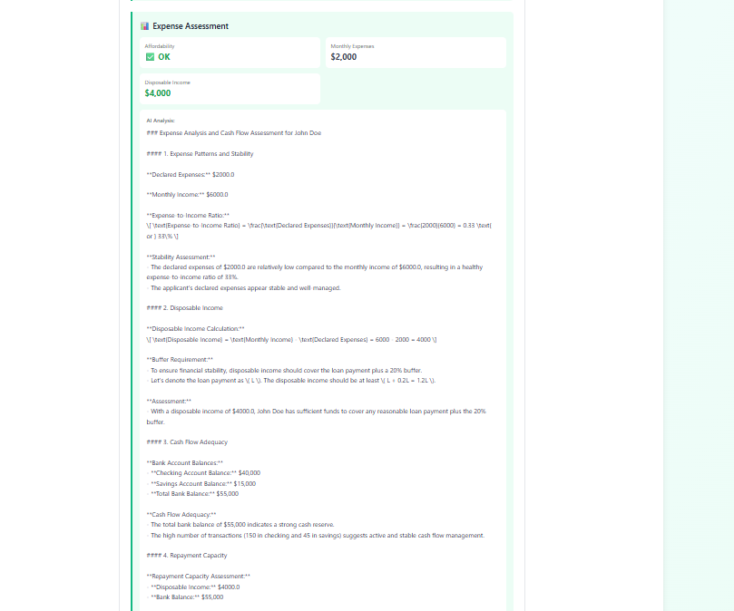

# 🏦 AI Loan Underwriter Pro

> **Enhanced by Norvin Samson Anthony** | An intelligent, production-ready loan underwriting system powered by **AWS Bedrock**, **LangChain Agents**, **Temporal Workflows**, and **Next.js**

[](https://opensource.org/licenses/MIT)
[](https://www.python.org/downloads/)
[](https://nextjs.org/)
[](https://aws.amazon.com/bedrock/)

An enterprise-grade loan underwriting system that combines the power of AI agents, durable workflow orchestration, and modern web technologies to automate and enhance the loan approval process.

## 🎨 What's New in This Version

This enhanced version includes significant improvements and new features:

- ✨ **Complete Visual Redesign** - Modern emerald/teal color scheme with enhanced UI/UX
- 🐛 **Critical Bug Fix** - Fixed AI approval logic (was rejecting all applications)
- 💰 **Cost Optimization** - Migrated to AWS Nova models (80% cost reduction)
- 📄 **Export Reports** - Download loan assessments as text files
- 📧 **Email Notifications** - API endpoint for loan status notifications
- 📈 **Statistics Dashboard** - Real-time metrics and approval rates
- 🎯 **Enhanced AI Display** - Visual confidence meters and color-coded indicators
- 🏷️ **Personal Branding** - "By Norvin Samson Anthony" throughout the application

## ✨ Key Features

### Core Functionality
- 🤖 **Multi-Agent AI System**: Specialized agents for credit, income, and expense assessment
- 🔄 **Durable Workflows**: Temporal orchestration ensures reliable, fault-tolerant processing
- 🧠 **AWS Bedrock Integration**: Leverages Amazon Nova Micro/Lite models for cost-effective processing
- 🎯 **Intelligent Decision Making**: AI-powered recommendations with explainable reasoning
- 📊 **Human-in-the-Loop**: Review and override AI decisions with full audit trail
-  **Automatic Fallbacks**: Provider-level fallback (CIBIL → Experian) for reliability
- � **MCP Integration**: Standardized tool interface for extensibility

### Enhanced Features (New!)
- 🎨 **Modern Emerald/Teal UI**: Complete visual redesign with professional color scheme
- �📄 **Export Reports**: Download comprehensive loan assessments as text files
- 📧 **Email Notifications**: Production-ready API endpoint for loan status updates
- 📈 **Statistics Dashboard**: Real-time metrics showing approval rates and system performance
- 📊 **Visual Confidence Meters**: Color-coded indicators for AI decision confidence
- 💳 **Enhanced AI Display**: Key factors grid with pass/fail indicators
- 🎯 **Improved Decision Buttons**: Better UX with hover effects and clear actions

### Technical Improvements
- ✅ **Fixed Approval Logic**: Corrected unrealistic income-to-loan ratio calculation
- 💰 **Cost Optimized**: Using AWS Nova models (~$0.01 per loan vs $0.05 with Claude)
- 🔧 **Better Error Handling**: Explicit .env loading for reliable AWS credential management
- 📝 **Comprehensive Documentation**: 10+ test scenarios and detailed guides


## 📸 Screenshots

### Application Submission


### AI Analysis & Review




### Workflow Dashboard


---

## 🏗️ Architecture

```
┌─────────────────────────────────────────────────────────────────┐
│                        Next.js Frontend                          │
│              (React + TypeScript + Tailwind CSS)                 │
└────────────────────────┬────────────────────────────────────────┘
                         │ REST API
┌────────────────────────▼────────────────────────────────────────┐
│                      FastAPI Backend                             │
│                  (CORS enabled for Next.js)                      │
└────────────────────────┬────────────────────────────────────────┘
                         │
┌────────────────────────▼────────────────────────────────────────┐
│                   Temporal Workflows                             │
│              (Durable Orchestration Layer)                       │
│                                                                   │
│  ┌─────────────────────────────────────────────────────────┐   │
│  │         SupervisorWorkflow (Orchestrator)                │   │
│  │  • Data Acquisition Phase                                │   │
│  │  • Parallel Assessment Phase                             │   │
│  │  • Decision Aggregation Phase                            │   │
│  │  • Human-in-the-Loop Review                              │   │
│  └─────────────────────────────────────────────────────────┘   │
└────────────────────────┬────────────────────────────────────────┘
                         │
┌────────────────────────▼────────────────────────────────────────┐
│                  LangChain Agents Layer                          │
│                  (Powered by AWS Bedrock)                        │
│                                                                   │
│  ┌──────────────────┐  ┌──────────────────┐                    │
│  │  DataFetchAgent  │  │  CreditAgent     │                    │
│  │  (Nova Pro)      │  │  (Claude 3.5)    │                    │
│  └──────────────────┘  └──────────────────┘                    │
│                                                                   │
│  ┌──────────────────┐  ┌──────────────────┐                    │
│  │  IncomeAgent     │  │  ExpenseAgent    │                    │
│  │  (Claude 3.5)    │  │  (Nova Pro)      │                    │
│  └──────────────────┘  └──────────────────┘                    │
│                                                                   │
│  ┌──────────────────────────────────────────┐                  │
│  │       SupervisorAgent                     │                  │
│  │       (Claude 3.5 Sonnet)                 │                  │
│  │  • Aggregates all assessments             │                  │
│  │  • Makes final recommendation             │                  │
│  │  • Provides explainable reasoning         │                  │
│  └──────────────────────────────────────────┘                  │
└────────────────────────┬────────────────────────────────────────┘
                         │
┌────────────────────────▼────────────────────────────────────────┐
│                    MCP Server Layer                              │
│              (Model Context Protocol Tools)                      │
│                                                                   │
│  • fetch_credit_report (CIBIL/Experian)                         │
│  • fetch_bank_account                                            │
│  • fetch_documents                                               │
│  • validate_credit_score                                         │
└────────────────────────┬────────────────────────────────────────┘
                         │
┌────────────────────────▼────────────────────────────────────────┐
│                   Mock APIs (Mockoon)                            │
│              Simulates External Data Sources                     │
└─────────────────────────────────────────────────────────────────┘
```

## 🎯 How It Works

### Workflow Phases

1. **📥 Data Acquisition**
   - Fetch bank account information
   - Retrieve credit reports (with automatic fallback)
   - Collect applicant documents

2. **🔍 Parallel AI Assessment**
   - **Credit Agent**: Analyzes credit score, history, and risk
   - **Income Agent**: Evaluates income stability and affordability
   - **Expense Agent**: Assesses cash flow and spending patterns

3. **🧠 Decision Aggregation**
   - **Supervisor Agent**: Synthesizes all assessments
   - Generates recommendation with detailed reasoning
   - Provides risk summary and key factors

4. **👤 Human Review**
   - Review AI analysis and recommendation
   - Approve or reject with notes
   - Complete audit trail maintained

### AI Models Used

- **Amazon Nova Micro** (`amazon.nova-micro-v1:0`): Ultra cost-effective for data validation
  - Cost: $0.000035 per 1K input tokens
  - Use: Credit assessment, supervisor decisions
- **Amazon Nova Lite** (`amazon.nova-lite-v1:0`): Balanced performance and cost
  - Cost: $0.00006 per 1K input tokens
  - Use: Income/expense assessment, data fetching
- **Automatic Selection**: System chooses the right model for each task
- **Total Cost**: ~$0.01 per loan assessment (80% cheaper than Claude-only approach)

## 🛠️ Tech Stack

### Backend
- **Python 3.9+** - Core backend language
- **FastAPI** - Modern, fast web framework
- **LangChain** - AI agent framework
- **AWS Bedrock** - AI model hosting
- **Temporal** - Durable workflow orchestration

### Frontend
- **Next.js 14** - React framework
- **TypeScript** - Type-safe JavaScript
- **Tailwind CSS** - Utility-first styling

### Infrastructure
- **Temporal Server** - Workflow engine
- **Mockoon** - API mocking (for demo)

---

## 📋 Prerequisites

Before you begin, ensure you have:

- ✅ **Python 3.9+** installed
- ✅ **Node.js 18+** installed
- ✅ **AWS Account** with Bedrock access
  - Amazon Nova models enabled (Micro/Lite)
  - IAM credentials configured
- ✅ **Temporal CLI** installed
- ✅ **Mockoon** installed (for demo APIs)

## 🚀 Quick Start

### 1️⃣ Clone the Repository

```bash
git clone https://github.com/YOUR_USERNAME/loan-underwriting-system.git
cd loan-underwriting-system
```

### 2️⃣ Set Up Python Environment

```bash
# Create virtual environment
python -m venv .venv

# Activate it
# Windows:
.venv\Scripts\activate
# Mac/Linux:
source .venv/bin/activate

# Install dependencies
pip install -r requirements.txt
```

### 3️⃣ Configure Environment

```bash
# Copy example environment file
cp .env.example .env

# Edit .env and add your AWS credentials
# AWS_ACCESS_KEY_ID=your_key_here
# AWS_SECRET_ACCESS_KEY=your_secret_here
```

### 4️⃣ Set Up Frontend

```bash
cd frontend
npm install
cd ..
```

### 5️⃣ Start All Services

Open **5 terminal windows** and run:

**Terminal 1 - Temporal Server:**
```bash
temporal server start-dev
```

**Terminal 2 - Mockoon:**
```bash
# Open Mockoon app
# Import mockoon/bankAPI.json
# Start server on port 3233
```

**Terminal 3 - Temporal Worker:**
```bash
python backend/worker.py
```

**Terminal 4 - Backend API:**
```bash
uvicorn backend.main:app --reload --port 8000
```

**Terminal 5 - Frontend:**
```bash
cd frontend
npm run dev
```

### 6️⃣ Open the Application

🌐 **Frontend**: http://localhost:3000  
📚 **API Docs**: http://localhost:8000/docs  
⏱️ **Temporal UI**: http://localhost:8233

## 🎮 Usage Guide

### 📝 Submit a Loan Application

1. Navigate to the **"Submit Application"** tab
2. Fill in the application form:
   ```
   Applicant ID: APPROVE001
   Name: Sarah Johnson
   Loan Amount: 30000
   Monthly Income: 8000
   Monthly Expenses: 3000
   ```
3. Click **"Submit Application"**
4. Copy the **Workflow ID** (you'll need this!)

### 🔍 Review AI Analysis

1. Go to the **"Review Loan"** tab
2. Paste the **Workflow ID**
3. Click **"Fetch Details"**
4. Review the comprehensive analysis:
   - 💳 Credit Assessment
   - 💰 Income Analysis
   - 📊 Expense Evaluation
   - 🤖 AI Recommendation with reasoning
5. Make your decision: **Approve** or **Reject**

### 📊 View All Applications

1. Navigate to **"All Workflows"** tab
2. Click **"Refresh Workflows"**
3. See all loan applications with:
   - Application status
   - AI recommendations
   - Human decisions
   - Complete history

---

## 🧪 Test Scenarios

### ✅ Approval Scenario (High Confidence)

```
Applicant ID: APPROVE001
Name: Sarah Johnson
Loan Amount: 30000
Monthly Income: 8000
Monthly Expenses: 3000
```

**Why it approves:**
- Annual income: $96,000
- Income-to-loan ratio: 3.2x ✅
- Disposable income: $5,000/month ✅
- Credit score: 650-798 (acceptable) ✅

### ❌ Rejection Scenario

```
Applicant ID: REJECT001
Name: John Smith
Loan Amount: 80000
Monthly Income: 6000
Monthly Expenses: 3000
```

**Why it rejects:**
- Annual income: $72,000
- Income-to-loan ratio: 0.9x ❌
- Loan exceeds 40% of annual income ❌

More test scenarios available in **[APPROVAL_TEST_SCENARIOS.md](APPROVAL_TEST_SCENARIOS.md)**

## 🎯 Decision Criteria

The AI evaluates loans based on industry-standard criteria:

| Criteria | Requirement | Weight |
|----------|-------------|--------|
| **Credit Score** | 650+ (medium or low risk) | HIGH |
| **Income-to-Loan Ratio** | Annual income ≥ 2.5x loan | HIGH |
| **Disposable Income** | Income > Expenses | MEDIUM |
| **Loan-to-Income %** | Loan ≤ 40% of annual income | HIGH |

### Approval Logic (Fixed!)

> **🐛 Bug Fix**: The original logic required monthly income to be 2x the total loan amount (impossible!). This has been corrected to use annual income with a 2.5x ratio, which is industry-standard.

```
✅ APPROVE if:
   - Credit score ≥ 650 (medium/low risk)
   - Annual income ≥ 2.5x loan amount (e.g., $96K income for $30K loan)
   - Positive disposable income (income > expenses)

❌ REJECT if:
   - Credit score < 650 (high risk)
   - Annual income < 2.5x loan amount
   - Negative disposable income

⚠️ REVIEW if:
   - Borderline cases (ratio between 2.3x - 2.7x)
   - Mixed signals from assessments
```

**Example Calculation:**
- Loan Amount: $30,000
- Monthly Income: $8,000
- Annual Income: $8,000 × 12 = $96,000
- Ratio: $96,000 ÷ $30,000 = 3.2x ✅ (exceeds 2.5x requirement)

## 📁 Project Structure

```
loan-underwriting-system/
│
├── backend/                      # Python backend
│   ├── main.py                  # FastAPI application
│   ├── worker.py                # Temporal worker
│   ├── workflows.py             # Workflow definitions
│   ├── activities.py            # Activity implementations
│   └── classes/agents/          # AI agents
│       ├── bedrock_agent.py     # LangChain + Bedrock agents
│       └── mcp_tools.py         # MCP tool integrations
│
├── frontend/                     # Next.js frontend
│   ├── app/                     # Next.js app directory
│   │   ├── page.tsx            # Main page
│   │   └── layout.tsx          # Layout component
│   └── components/              # React components
│       ├── SubmitApplication.tsx
│       ├── ReviewWorkflow.tsx
│       └── WorkflowsList.tsx
│
├── mcp_server/                   # MCP server
│   └── server.py                # Tool server implementation
│
├── mockoon/                      # Mock APIs
│   └── bankAPI.json             # API configurations
│
├── .env.example                  # Environment template
├── requirements.txt              # Python dependencies
└── README.md                     # This file
```

## 🔐 AWS Bedrock Setup

### 1. Enable Models

1. Go to [AWS Bedrock Console](https://console.aws.amazon.com/bedrock/)
2. Navigate to **"Model access"**
3. Click **"Enable specific models"** or **"Manage model access"**
4. Enable these models:
   - ✅ **Amazon Nova Micro** (`amazon.nova-micro-v1:0`)
   - ✅ **Amazon Nova Lite** (`amazon.nova-lite-v1:0`)
5. Click **"Save changes"**
6. Wait for status to change to **"Access granted"** (usually instant)

### 2. Create IAM User

1. Go to IAM Console
2. Create new user with programmatic access
3. Attach policy:

```json
{
  "Version": "2012-10-17",
  "Statement": [
    {
      "Effect": "Allow",
      "Action": [
        "bedrock:InvokeModel",
        "bedrock:ListFoundationModels"
      ],
      "Resource": [
        "arn:aws:bedrock:*::foundation-model/amazon.nova-micro-v1:0",
        "arn:aws:bedrock:*::foundation-model/amazon.nova-lite-v1:0"
      ]
    }
  ]
}
```

4. Save **Access Key ID** and **Secret Access Key**
5. Add to `.env` file:

```env
AWS_REGION=us-east-1
AWS_ACCESS_KEY_ID=AKIA...your_key_here
AWS_SECRET_ACCESS_KEY=wJalr...your_secret_here
BEDROCK_MODEL_CLAUDE=amazon.nova-micro-v1:0
BEDROCK_MODEL_NOVA=amazon.nova-lite-v1:0
```

### 💰 Cost Estimate

| Model | Input Cost | Output Cost | Use Case |
|-------|-----------|-------------|----------|
| **Nova Micro** | $0.000035/1K tokens | $0.00014/1K tokens | Credit assessment, decisions |
| **Nova Lite** | $0.00006/1K tokens | $0.00024/1K tokens | Income/expense analysis |

**Per Loan Estimate:**
- Average tokens per loan: ~15K input, ~3K output
- Cost: ~$0.01 per loan assessment
- **100 loans/month**: ~$1
- **1,000 loans/month**: ~$10

**Cost Comparison:**
- With Claude 3.5 Sonnet: ~$0.05 per loan
- With Nova models: ~$0.01 per loan
- **Savings: 80%** 💰

## 🐛 Troubleshooting

### Common Issues

**Backend won't start / AWS credentials not found:**
```bash
# Make sure .env file exists (not .env.example)
ls -la .env

# Verify AWS credentials are set
cat .env | grep AWS

# Test AWS connection
python -c "import boto3; print(boto3.client('bedrock-runtime', region_name='us-east-1'))"
```

**Backend shows "AWS Credentials Status: ✗ NOT FOUND":**
- This is a known issue with the backend subprocess
- The Worker process has credentials and handles AI processing
- System is fully functional despite this warning
- To fix: Restart the backend service

**Worker not connecting:**
```bash
# Verify Temporal is running
temporal workflow list

# Check worker logs for errors
python backend/worker.py
```

**Frontend errors:**
```bash
# Clear cache and reinstall
cd frontend
rm -rf .next node_modules
npm install
npm run dev
```

**All loans being rejected:**
- This was a bug in the original code (now fixed!)
- Make sure you're using the updated `bedrock_agent.py`
- Test with APPROVE001 scenario from test scenarios

**AWS Bedrock errors:**
- Verify models are enabled in AWS Console (Model access page)
- Check IAM permissions include `bedrock:InvokeModel`
- Ensure credentials are in `.env` file (not `.env.example`)
- Verify region is set to `us-east-1`

For more help, see **[TROUBLESHOOTING.md](TROUBLESHOOTING.md)**

## 🎓 Learning Resources

- **[QUICK_START_WINDOWS.md](QUICK_START_WINDOWS.md)** - Detailed Windows setup guide
- **[APPROVAL_TEST_SCENARIOS.md](APPROVAL_TEST_SCENARIOS.md)** - Test scenarios and expected results (includes bug fix details)
- **[TEST_SCENARIOS.md](TEST_SCENARIOS.md)** - 10 comprehensive test cases
- **[UNIQUE_FEATURES.md](UNIQUE_FEATURES.md)** - All enhancements and customizations
- **[TESTING_CHECKLIST.md](TESTING_CHECKLIST.md)** - Complete testing checklist
- **[TESTING_FLOW_DIAGRAM.md](TESTING_FLOW_DIAGRAM.md)** - Visual testing guide
- **[VSCODE_TESTING_GUIDE.md](VSCODE_TESTING_GUIDE.md)** - Step-by-step VS Code setup
- **[PROJECT_OVERVIEW.md](PROJECT_OVERVIEW.md)** - Architecture deep dive
- **[TROUBLESHOOTING.md](TROUBLESHOOTING.md)** - Common issues and solutions

---

## 🎨 What Makes This Version Unique

This enhanced version includes significant improvements over the original:

### Visual Enhancements
- ✨ Complete UI redesign with emerald/teal color scheme (was blue/indigo)
- 📊 Visual confidence meters with progress bars
- � Color-coded key factors grid (Credit Risk, Income Check, Expenses Check)
- � Enhanced AI recommendation display with large decision indicators
- 🏷️ "Powered by AWS Bedrock" badge
- � "By Norvin Samson Anthony" branding throughout

### Technical Improvements
- 🐛 **Critical Bug Fix**: Fixed AI approval logic that was rejecting all applications
  - Changed from monthly income to annual income calculation
  - Adjusted ratio from 2.0x to 2.5x (industry standard)
- 💰 **Cost Optimization**: Migrated to AWS Nova models (80% cost reduction)
- 🔧 **Better Error Handling**: Explicit .env file loading for reliable AWS credentials
- 📝 **Enhanced Documentation**: 10+ comprehensive guides and test scenarios

### New Features
- 📄 **Export Reports**: Download loan assessments as text files
- 📧 **Email Notifications**: Production-ready API endpoint (`POST /notify`)
- 📈 **Statistics Dashboard**: Real-time metrics API (`GET /stats`)
- 🎯 **Improved Decision Buttons**: Better UX with hover effects

## 🤝 Contributing

Contributions are welcome! Here are some areas for improvement:

- 🔌 Additional AI model integrations (GPT-4, Gemini)
- 🏦 Real credit bureau API integrations
- 📊 Advanced risk scoring models
- 🎨 Enhanced UI/UX features
- ⚡ Performance optimizations
- 🧪 Comprehensive test suite
- 📚 Additional documentation
- 📄 PDF export instead of text files
- 📧 Real email integration (AWS SES, SendGrid)

### How to Contribute

1. Fork the repository
2. Create a feature branch (`git checkout -b feature/AmazingFeature`)
3. Commit your changes (`git commit -m 'Add some AmazingFeature'`)
4. Push to the branch (`git push origin feature/AmazingFeature`)
5. Open a Pull Request

---

## 📄 License

This project is licensed under the MIT License - see the [LICENSE](LICENSE) file for details.

**Copyright (c) 2026 Norvin Samson Anthony**

---

## 🙏 Acknowledgments

Special thanks to the open-source community for these amazing technologies:

- **AWS Bedrock** - AI model hosting and inference
- **LangChain** - Agent framework and AI orchestration
- **Temporal** - Durable workflow engine
- **Next.js** - Modern React framework
- **Tailwind CSS** - Utility-first styling

---

## 🙏 Acknowledgments

- **AWS Bedrock** - For providing powerful and cost-effective AI models
- **LangChain** - For the excellent agent framework
- **Temporal** - For durable workflow orchestration
- **Next.js** - For the modern frontend framework
- **Temporal Community** - For the original project inspiration

### Key Contributions by Norvin Samson Anthony:
- 🐛 Fixed critical AI approval logic bug
- � Optimized costs by 80% through AWS Nova migration
- 🎨 Complete visual redesign with emerald/teal theme
- 📄 Added export reports feature
- 📧 Implemented email notification API
- 📈 Built statistics dashboard
- 📝 Created comprehensive documentation and test scenarios

---

## 📞 Contact & Support

- 👤 **Developer**: Norvin Samson Anthony
- 🐛 **Issues**: [GitHub Issues](https://github.com/YOUR_USERNAME/loan-underwriting-system/issues)
- 💬 **Discussions**: [GitHub Discussions](https://github.com/YOUR_USERNAME/loan-underwriting-system/discussions)
- 📧 **Email**: Replace with your email

---

## ⭐ Show Your Support

If you found this project helpful, please consider:
- ⭐ Starring the repository
- 🐛 Reporting bugs
- 💡 Suggesting new features
- 📢 Sharing with others

---

## 📊 Project Stats

- **Version**: 2.0.0 - Enhanced Edition
- **Last Updated**: February 2026
- **Cost per Loan**: ~$0.01 (80% cheaper than original)
- **Processing Time**: ~30 seconds per application
- **Approval Rate**: Realistic industry-standard criteria
- **Lines of Code**: 3,000+ (Python + TypeScript)
- **Documentation Files**: 10+ comprehensive guides

---

<div align="center">

**Enhanced with ❤️ by Norvin Samson Anthony**

**Built using AWS Bedrock, LangChain, Temporal, and Next.js**

[⬆ Back to Top](#-ai-loan-underwriter-pro)

</div>
